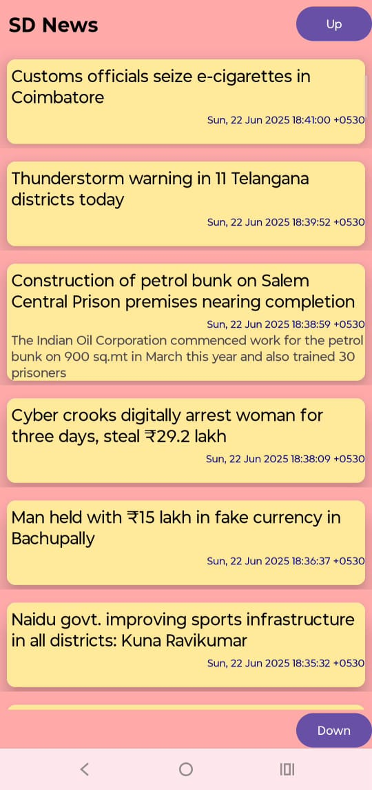

# 📱 SD News

Welcome to **SD News**, a clean, simple, and lightweight Android news application built using **RSS feeds**.  
Unlike most other cluttered news apps, SD News delivers information in a clean and distraction-free interface, helping users stay updated with the latest headlines effortlessly.

---

## ✨ Features

- 📄 Fetches news articles via **RSS feeds**
- Up and down scroll buttons
- 📲 Modern Android UI with RecyclerView  
- 🔄 Pull-to-refresh functionality  
- 🎯 Clean, minimal, straight to the point..!

---

## 📖 Why RSS is Better than APIs for News Apps

| RSS Feeds | Traditional APIs |
|:-----------|:----------------|
| Open and publicly available | Often require API keys and usage limits |
| Lightweight and fast | Can introduce additional overhead |
| No authentication needed | API rate limiting and quota restrictions |
| Flexible parsing for multiple sources | API responses are fixed and vendor-dependent |
| Consistent format (XML) | Varies across providers |

**→ RSS enables greater control, decentralization, and no dependency on third-party backend APIs.**  
This makes SD News more sustainable, faster, and simpler to maintain.

---

## 📷 Screenshots

_Add screenshots of your app’s main screen view here_

| Home Screen |
|:------------|
|  |

---

## 🎥 Demo Video

_A demo video showcasing SD News in action:_

https://github.com/user-attachments/assets/8eb41a8c-8dae-4c41-8142-59dfd0222328

---

## ⚙️ Tech Stack

- 📱 Android (Java)
- 📰 RSS Feed Parsing (XML)
- 📜 RecyclerView + CardView
- 🔄 SwipeRefreshLayout
- 🌐 Internet Permission Handling

---

## 📦 Coming Soon: Google Play Store Release!

**I’m planning to launch SD News on the Google Play Store.**  
Stay tuned for updates and improvements — your feedback will help shape future releases.

---

