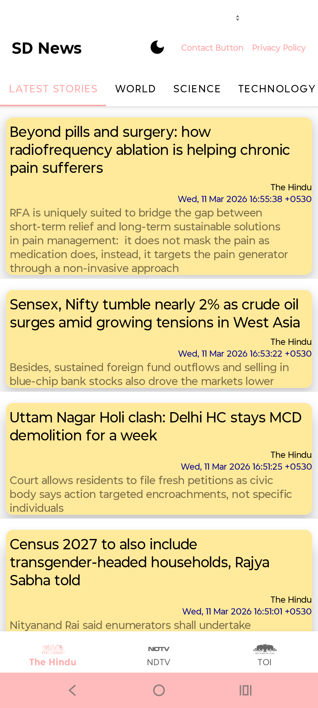
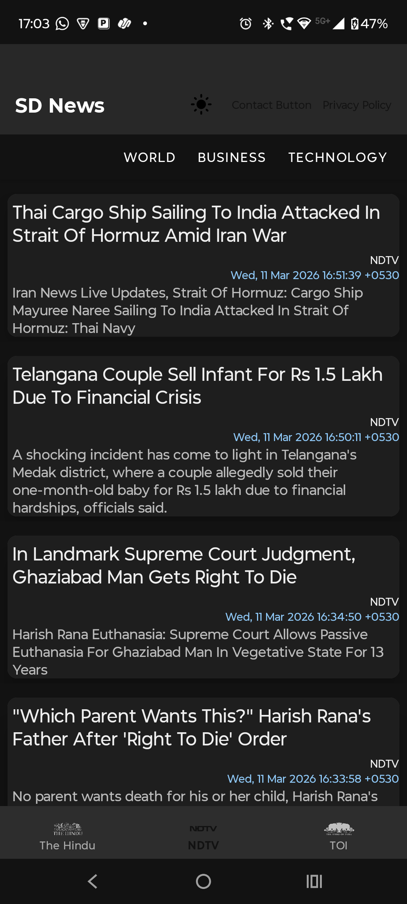

# 📱 SD News

Welcome to **SD News**, a clean, simple, and lightweight Android news application built using **RSS feeds**.  
Unlike most other cluttered news apps, SD News delivers information in a clean and distraction-free interface, helping users stay updated with the latest headlines effortlessly.
 
---

## ✨ Features

- 📄 Fetches news articles via **RSS feeds**
- 🗞️ Multiple news sources — The Hindu, NDTV, Times of India
- 🗂️ Category tabs — Top Stories, World, Science, Technology, Sports
- 🌙 Dark Mode with persistent preference
- 📲 Modern Android UI with RecyclerView + CardView
- 🔄 Pull-to-refresh functionality
- 🧭 Bottom Navigation Bar for switching sources
- 📖 Bottom Sheet article preview — tap any card to read the summary instantly
- 🌐 In-app Reader Mode — clean, ad-free full article view powered by Mozilla Readability
- 🔗 Share articles with SD News branding via any app (WhatsApp, Telegram, SMS...)
- 🔔 Daily news reminder notification at 8:00 AM — powered by WorkManager
- 🎯 Clean, minimal, straight to the point..!

---

## 🗞️ News Sources

| Source | Categories |
|:-------|:-----------|
| The Hindu | Top Stories, World, Science, Technology, Sports |
| NDTV | Top Stories, World, Science, Technology, Sports |
| Times of India | Top Stories, World, Science, Technology, Sports |
 
---

## 📖 How Reading Works

```
Tap any news card
        ↓
Bottom Sheet slides up — shows source, date, headline, and RSS summary
        ↓
        ├── Tap "Share"             → share article with SD News branding
        └── Tap "Read Full Article" → opens in-app Reader Mode
                        ↓
                Clean, ad-free article view
                powered by Mozilla Readability.js
                Respects your dark / light theme
                        ↓
                Share button in toolbar
                → share directly from the article
```
 
---

## 🔔 Daily Notifications

SD News reminds you every morning at **8:00 AM** to catch up on the day's news.  
Notifications rotate daily with fresh messages — no repetition, no spam.  
Powered by **WorkManager** — no backend or internet required to deliver them.
 
---

## 📖 Why RSS is Better than APIs for News Apps

| RSS Feeds | Traditional APIs |
|:-----------|:----------------|
| Open and publicly available | Often require API keys and usage limits |
| Lightweight and fast | Can introduce additional overhead |
| No authentication needed | API rate limiting and quota restrictions |
| Flexible parsing for multiple sources | API responses are fixed and vendor-dependent |
| Consistent format (XML) | Varies across providers |

**→ RSS enables greater control, decentralization, and no dependency on third-party backend APIs.**  
This makes SD News more sustainable, faster, and simpler to maintain.
 
---

## 📷 Screenshots


| Home Screen |
|:------------|
|  |

| Dark Mode |
|:------------|
|  |

| Material Bottom Sheet                        |
|:---------------------------------------------|
|  |
---

## ⚙️ Tech Stack

- 📱 Android (Java)
- 📰 RSS Feed Parsing (XML) — with CDATA, namespace, and Atom support
- 📜 RecyclerView + CardView
- 🔄 SwipeRefreshLayout
- 🧭 ViewPager2 + TabLayout (category tabs)
- 🗂️ Bottom Navigation Bar (source switching)
- 📋 Material Bottom Sheet (article preview)
- 🌐 WebView + Mozilla Readability.js (in-app reader mode)
- 🌙 AppCompatDelegate (Dark Mode)
- 🔗 Android Intent Share Sheet (article sharing)
- 🔔 WorkManager (daily notification scheduling)
- 🌐 Internet Permission Handling

---

## 🗺️ Roadmap

| Phase | Feature | Status |
|:------|:--------|:-------|
| ✅ Phase 1 | Multi-source RSS feeds (The Hindu, NDTV, TOI) | Done |
| ✅ Phase 1 | Category tabs (Top Stories, World, Science, Tech, Sports) | Done |
| ✅ Phase 1 | Dark Mode | Done |
| ✅ Phase 1 | Bottom Navigation Bar | Done |
| ✅ Phase 2 | Better RSS parser (CDATA, namespaces, Atom, edge cases) | Done |
| ✅ Phase 2 | Bottom Sheet article preview | Done |
| ✅ Phase 2 | In-app Reader Mode (Mozilla Readability.js) | Done |
| ✅ Phase 2 | Share articles with SD News branding | Done |
| ✅ Phase 3 | Daily news reminder notifications (WorkManager) | Done |
| 🔜 Phase 4 | Offline Reading (Room DB cache) | Planned |
| 🔜 Phase 5 | Android App Links (deep linking) | Planned |

## 📦 Google Play Store

**SD News is live on the Google Play Store!**  
Download it here → [SD News on Google Play](https://play.google.com/store/apps/details?id=com.sd.sdnews)

---